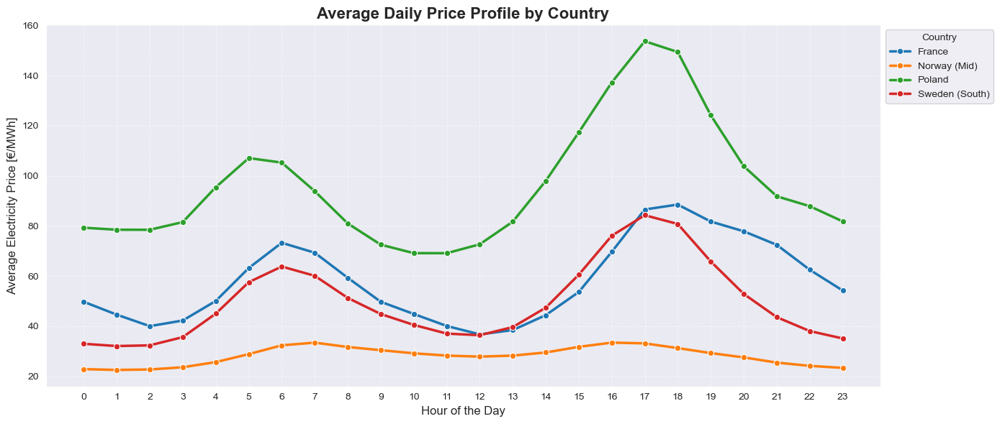
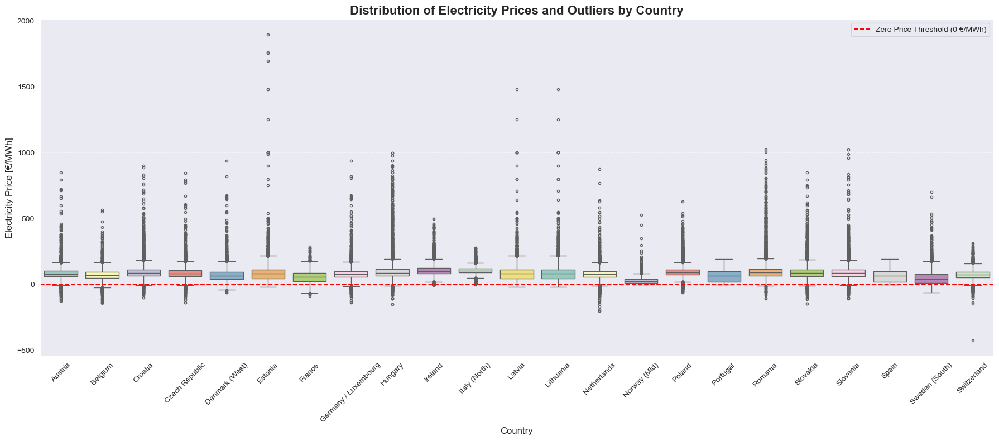
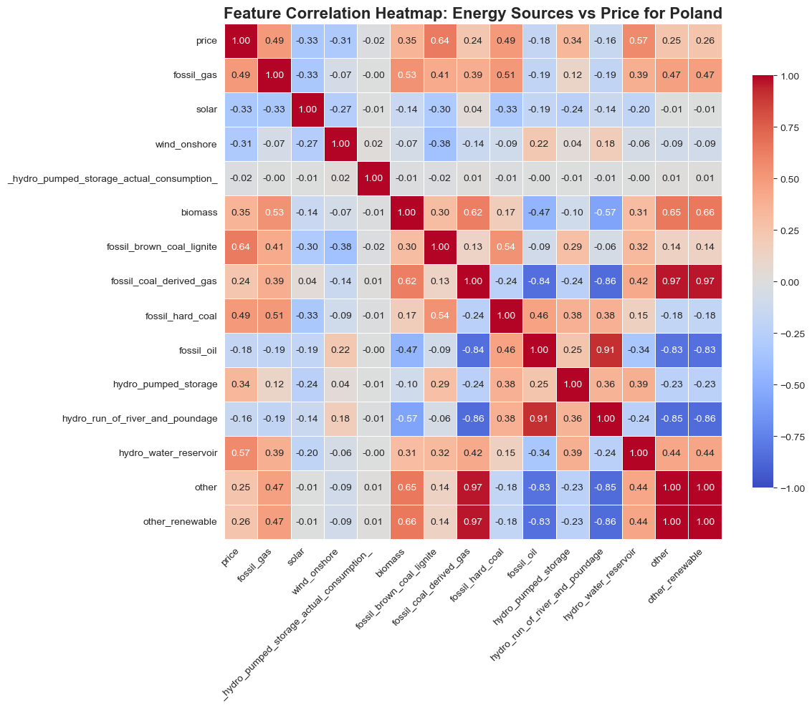
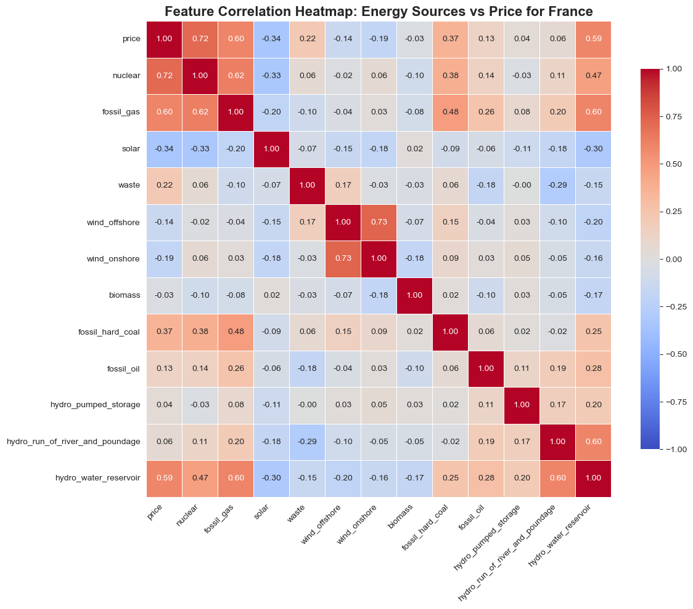
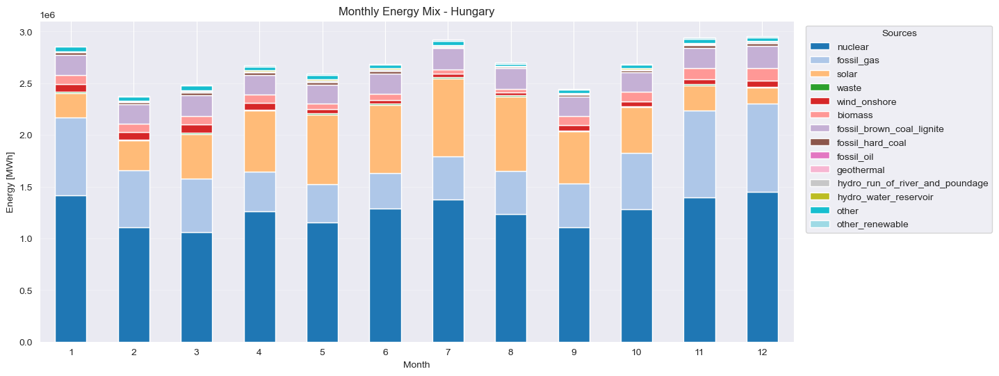

#  European Energy Market Price Prediction

## Part 1: Data Preprocessing, Quality Control, and EDA
The foundation of any robust Machine Learning model is clean, reliable, and well-understood data. 
The first phase of this project focuses on processing raw historical energy data (2024-2025) across multiple European markets, 
ensuring data integrity, and discovering structural market behaviors.

### 🛠 Data Pipeline & Quality Assurance
Working with real-world energy market data requires handling inconsistencies, missing values, and overlapping features. 
Key steps in this phase included:
* **Structural Inspection & Temporal Standardization:** Converting raw strings to timezone-aware datetime objects to enable time-series operations.
* **Per-Country Quality Audit:** Generating detailed missing data matrices and handling structural gaps (e.g., 
* lack of offshore wind in landlocked countries).
* **Feature Harmonization:** Cross-referencing and merging redundant `_actual_aggregated_` columns to reduce dimensionality without data loss.
* **Time-Series Imputation:** Applying linear interpolation grouped by country to fill short-term transmission gaps.
* **Cyclical Feature Extraction:** Engineering baseline temporal features (Hour, Day, Month, Weekend) to capture human behavior patterns.

###  Key Insights & Market Behavior

During the Exploratory Data Analysis (EDA), several critical market dynamics were uncovered that will heavily influence the predictive models:

#### 1. The "Duck Curve" Effect
The daily price profile reveals the massive impact of solar generation. Countries with high photovoltaic capacity 
experience a sharp drop in prices during midday, followed by a severe spike in the evening when the sun sets and peak demand hits.

#### 2. Market Volatility & Negative Prices
By analyzing the distribution of prices, we can observe the stability of different markets. Extreme outliers 
(spikes up to hundreds of Euros or drops below 0 €/MWh) highlight the volatility caused by weather dependency and grid inflexibility.

#### 3. Drivers of Price: Correlation Analysis
To prove the mathematical viability of our upcoming models, we analyzed the correlation between generation sources and price. 
A s dictated by the Merit Order effect, renewables (wind, solar) show a strong negative correlation with price, while fossil fuels (coal, gas) show a strong positive correlation during peak demand.

> 
#### 4. Energy Mix Diversity
Each country operates on a fundamentally different energy mix, meaning a global model would fail. 
The baseline generation source dictates the market's baseline price (e.g., stable nuclear in Hunguary vs. weather-dependent wind in Denmark).

### Part 2: Feature Engineering (Time-Series Memory)
Standard tabular Machine Learning models (like Linear Regression, XGBoost, or LightGBM) process data row by row and natively lack the concept of "time" or "memory". To accurately predict electricity prices, we must manually translate the chronological nature of the market into mathematical features. 

In this critical step, we engineered two types of time-series features to give our models context:

* **Lag Features (24h & 168h):** Electricity markets are highly cyclical. We created shifted columns representing the exact price 24 hours ago (capturing the daily circadian rhythm of the grid) and 168 hours ago (capturing the weekly cycle, e.g., matching a Monday morning to the previous Monday morning).
* **Rolling Window Statistics:** By calculating moving averages (e.g., the mean price over the trailing 24 hours), we provided the models with "momentum" indicators. This helps the algorithm understand macro-trends, market sentiment, and smooths out sudden, temporary price spikes (outliers).