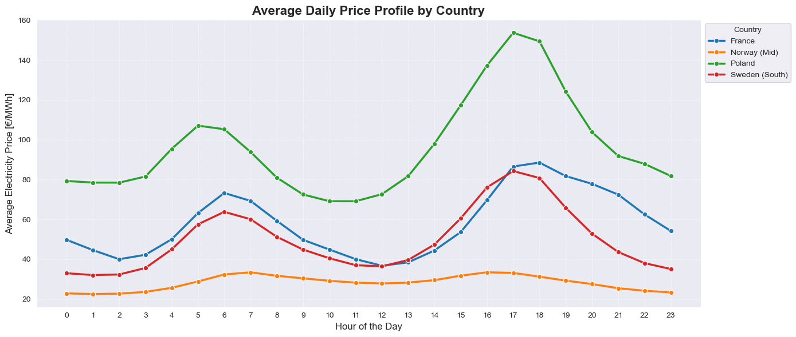
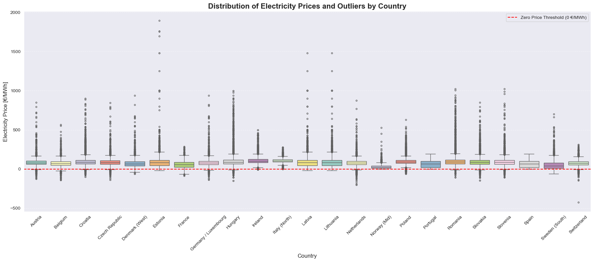
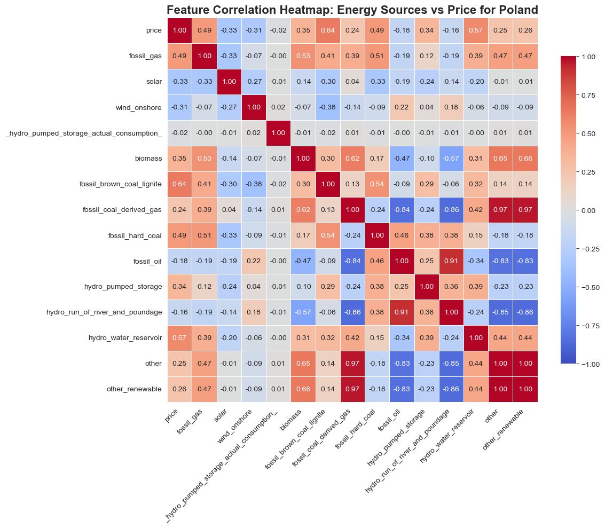
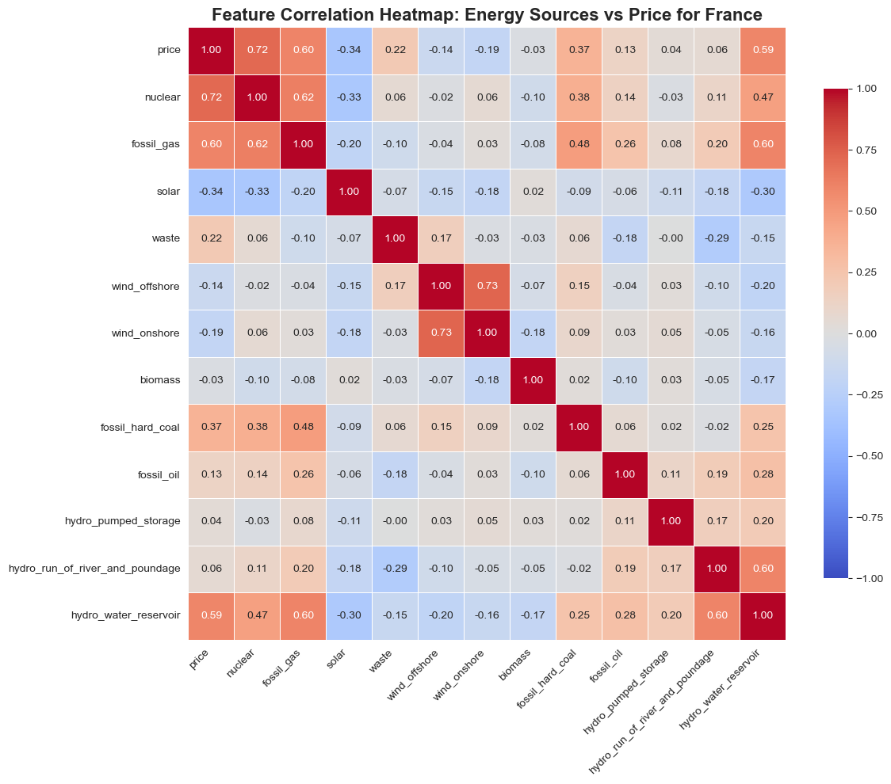
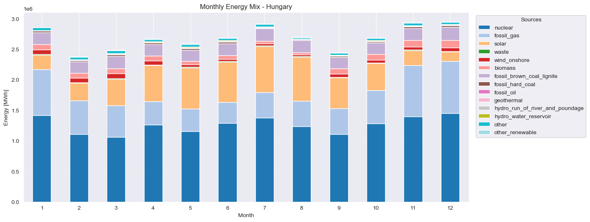
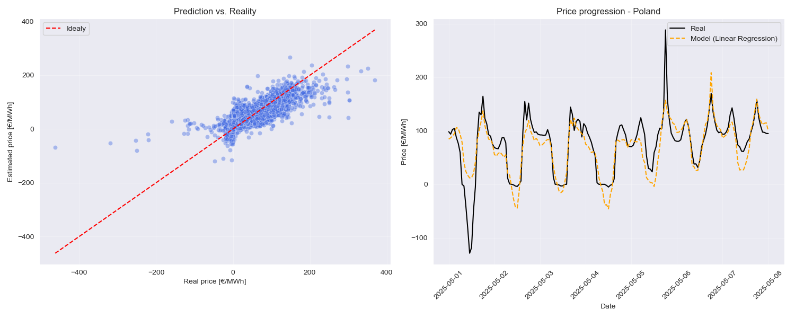
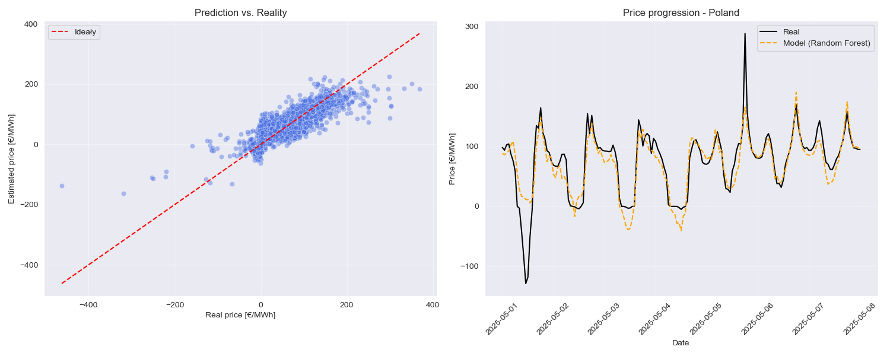
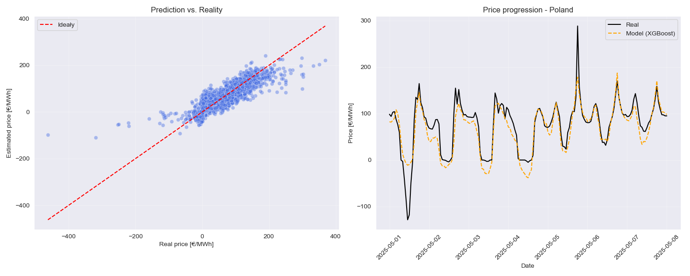

#  European Energy Market Price Prediction
> **Project Overview (TL;DR)**
> * **Objective:** Predict Day-Ahead electricity prices across multiple European markets by modeling the physical and economic drivers of the power grid.
> * **Dataset:** >260,000 hourly records (2024-2025) sourced from ENTSO-E, integrating generation mix (renewables vs. fossil fuels), structural market limits, and temporal data.
> * **Key Insights:** Market pricing is highly non-linear, heavily influenced by the "Duck Curve" (solar oversupply causing negative prices) and the Merit Order effect (gas/coal setting peak prices).
> * **Modeling Pipeline:** Progressed from a naive time-series baseline through Linear Regression and Random Forest, culminating in optimized Gradient Boosting architectures.
> * **Best Performance:** **XGBoost** achieved the highest accuracy (**MAE: 17.29 €/MWh, R²: 0.80**), successfully outperforming the 24h naive baseline (MAE: 24.88 €). **LightGBM** provided the best computational efficiency (98% faster training than Random Forest).
## Part 1: Data Preprocessing & Quality Control
Phase 1 focuses on standardizing raw historical ENTSO-E energy data (2024-2025) across European markets, resolving API inconsistencies, and handling structural missing values to prepare the dataset for downstream modeling.

### Data Engineering Pipeline
Key preprocessing steps included:
* **Temporal Standardization:** Parsing raw strings into timezone-aware UTC datetime objects for accurate time-series operations.
* **Structural Gap Handling:** Identifying and resolving domain-specific missing data (e.g., hardcoding zeros for offshore wind generation in landlocked countries).
* **Feature Harmonization:** Cross-referencing and merging redundant `_actual_aggregated_` generation columns to reduce dimensionality.
* **Time-Series Imputation:** Applying grouped linear interpolation (limit=24h) to patch short-term sensor or transmission gaps without leaking future data.
* **Calendar Features:** Extracting temporal components (Hour, Month, Day of Week, Weekend flag) to explicitly encode daily and seasonal grid demand cycles.

### Key Insights & Market Behavior

Exploratory Data Analysis (EDA) highlighted several structural market behaviors that directly informed feature selection and model architecture:

#### 1. The "Duck Curve" Effect
High photovoltaic capacity causes predictable midday price depressions, followed by steep evening spikes as solar generation drops off against peak grid demand.

#### 2. Price Volatility & Negative Prices
Distribution analysis reveals significant variance across European markets. Extreme outliers—including negative prices (sub-zero €/MWh)—reflect periods of renewable oversupply coupled with grid inflexibility.

#### 3. Correlation & The Merit Order Effect
Correlation matrices confirm the physical rules of the energy market: zero-marginal-cost renewables (wind, solar) exhibit strong negative correlations with price, while dispatchable fossil fuels (gas, hard coal) show positive correlations.

#### 4. Energy Mix Heterogeneity
Generation portfolios vary significantly by region, directly impacting price stability (e.g., stable nuclear baseloads vs. weather-dependent wind grids). This structural divergence necessitates country-level feature encoding rather than a single generalized global model.

### Part 2: Temporal Feature Engineering

To adapt tabular models for time-series forecasting, we engineered explicit temporal features to capture market autocorrelation and seasonality.

* **Autoregressive Lags (24h & 168h):** Time-shifted target variables (`price_lag_24h`, `price_lag_168h`) to explicitly encode the daily and weekly operational cycles of the power grid.
* **Rolling Statistics (24h Mean):** Moving averages computed over the trailing 24 hours. This feature provides the models with short-term trend context and smooths out high-frequency price volatility (outliers).

### Part 3: Naive Baseline Evaluation

To establish a minimum performance threshold, we implemented a naive time-series baseline. Given the strong daily seasonality of electricity markets, we used a pure 24-hour lag prediction ($y_t = y_{t-24}$). 

**Global Baseline Metrics:**
* **MAE:** 24.88 €/MWh
* **RMSE:** 38.71 €/MWh
* **R²:** 0.5074

**Baseline Analysis:**
* **Seasonality:** The R² score indicates that the basic 24-hour grid cycle alone explains ~51% of the total price variance.
* **Outlier Sensitivity:** The significant spread between MAE and RMSE highlights the naive rule's failure to handle extreme market anomalies (e.g., negative prices or sudden demand spikes).
* **Modeling Objective:** Subsequent machine learning models must capture the remaining ~49% of the variance by learning the non-linear interactions between weather-dependent renewables, fossil fuel dispatch, and temporal features.

### Part 4: Baseline ML Model - Linear Regression

We implemented a **Linear Regression** model as our initial machine learning baseline. To prevent data leakage and ensure reproducibility, all preprocessing and modeling steps were integrated into a `scikit-learn` Pipeline.

**Preprocessing Strategy:**
* **Numerical Features (Generation, Lags):** Mean imputation followed by `StandardScaler` to handle the varying scales of power generation (MW).
* **Categorical Features (Countries):** `OneHotEncoder` to capture country-specific market dynamics.

**Performance Metrics:**
* **MAE:** 21.66 €/MWh *(-3.22 € vs. Naive Baseline)*
* **RMSE:** 30.47 €/MWh
* **R²:** 0.6948

**Limitations:**
While the linear model effectively captures general market trends and daily seasonality, it fails to predict non-linear market events. As shown in the time-series visualization below, it struggles to forecast negative prices driven by high renewable generation (e.g., simultaneous wind and solar oversupply).

**Results:**

### Part 5: Non-Linear Models - Random Forest

To address the limitations of Linear Regression in capturing complex, non-linear market dynamics (e.g., negative prices driven by high renewable generation during weekends), we implemented a tree-based ensemble method: the **Random Forest Regressor**. The preprocessing pipeline remained identical to ensure a direct baseline comparison.

**Performance Metrics (n_estimators=200, max_depth=25):**
* **MAE:** 18.71 €/MWh *(-2.95 € vs. Linear Regression)*
* **RMSE:** 26.85 €/MWh
* **R²:** 0.7629

**Computational Cost:**
Training the model on the full dataset (>260,000 rows) took **~128 seconds** utilizing parallel processing (`n_jobs=-1`). This establishes a baseline for evaluating the trade-off between ensemble accuracy and computational latency in later stages.

**Results:**
As shown in the time-series evaluation below, the decision tree architecture successfully captures deep negative price anomalies during periods of oversupply—a critical market behavior the linear model failed to reproduce.

### Part 6: Gradient Boosting - LightGBM

To evaluate a gradient boosting architecture, we replaced the Random Forest bagging approach with Microsoft's **LightGBM**. This model builds trees sequentially to correct prior residuals and uses a leaf-wise growth strategy optimized for large tabular datasets. 

For a direct comparison, we maintained the same preprocessing pipeline and hyperparameter baseline (200 estimators).

**Performance Metrics (200 Estimators):**
* **MAE:** 17.56 €/MWh *(-1.15 € vs. Random Forest)*
* **RMSE:** 24.97 €/MWh
* **R²:** 0.7950

**Computational Efficiency & Production Viability:**
The transition to LightGBM yielded significant improvements in training speed. While the 200-tree Random Forest required ~128 seconds to fit >260,000 rows, LightGBM converged in just **2.65 seconds** (a ~98% reduction in training time) while simultaneously decreasing the absolute error. 

From a production standpoint, this efficiency severely reduces the cloud compute costs associated with frequent model retraining pipelines.

**Results:**

### Part 7: Final Model - XGBoost

For the final evaluation, we implemented **XGBoost** to compare its level-wise tree growth algorithm and advanced regularization against LightGBM. 

**Performance Metrics (200 Estimators):**
* **MAE:** 17.29 €/MWh *(Lowest project error, -0.27 € vs. LightGBM)*
* **RMSE:** 24.63 €/MWh
* **R²:** 0.8006

**Performance Trade-off: XGBoost vs. LightGBM**
* **Computational Cost:** LightGBM trained slightly faster (2.65s) than XGBoost (2.90s). Both gradient boosting implementations were orders of magnitude more efficient than the Random Forest baseline (~128s).
* **Predictive Accuracy:** XGBoost captured deeper non-linear interactions, achieving an R² of 0.80 and slightly outperforming LightGBM in absolute error reduction.

**Conclusion:** LightGBM remains the optimal choice for high-frequency environments requiring rapid model retraining. However, for Day-Ahead forecasting where marginal accuracy improvements directly translate to financial optimization, XGBoost provides the best performance for this dataset.

**Results:**
